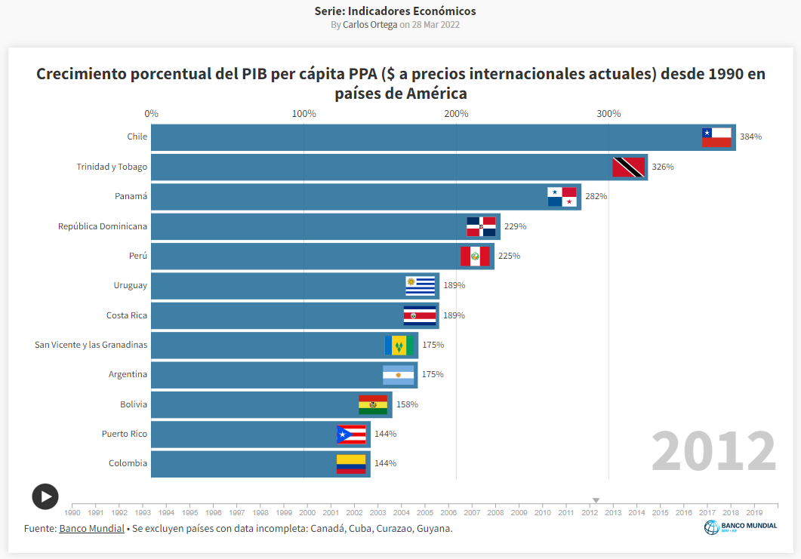

# 👋 ¡Hola, soy Carlos Ortega!

Un entusiasta de los datos altamente motivado y programador de Python buscando activamente nuevas oportunidades laborales en el campo de la Analítica de Datos/Ciencia de Datos, Desarrollo FullStack de Python y roles de DevOps.

## 🔍 Sobre mí

Soy apasionado por la Analítica de Datos/Ciencia de Datos y disfruto sumergirme en los datos para descubrir ideas significativas y tomar decisiones informadas. Además, tengo una gran afinidad por la programación en Python y me encanta aprovechar su versatilidad para automatizar tareas y resolver problemas complejos.

## 🐍 Entusiasta de Python

Con una sólida base en Python, estoy constantemente ampliando mis habilidades en manipulación, análisis, visualización y aprendizaje automático de datos. También tengo experiencia en desarrollo FullStack de Python, lo que incluye trabajar con Django para el desarrollo backend y otros marcos modernos para el desarrollo frontend.

## 🎓 Bootcamp de Desarrollo FullStack de Python

Recientemente, completé un riguroso bootcamp de Desarrollo FullStack de Python, donde perfeccioné mis habilidades en el desarrollo de aplicaciones web de principio a fin, la creación de APIs y el trabajo con bases de datos. Estoy emocionado por aplicar estas habilidades en proyectos del mundo real y contribuir a soluciones significativas.

## 📊 Proyectos de Analítica de Datos

Creo que visualizar datos es una forma poderosa de comunicar los hallazgos de manera efectiva. Aquí tienes un ejemplo de mi proyecto de visualización de datos:

¡Haz clic en la imagen de arriba para ver la **Carrera de Gráficos de Barras** en acción!

## 📫 Conectemos

No dudes en ponerte en contacto conmigo en carlosortega77@gmail.com. Ya sea para discutir posibles colaboraciones, oportunidades laborales o simplemente conectar con otros profesionales, siempre estoy abierto a participar en conversaciones enriquecedoras.

## 🌐 Conéctate conmigo:

<!---
cortega26/cortega26 is a ✨ special ✨ repository because its `README.md` (this file) appears on your GitHub profile.
You can click the Preview link to take a look at your changes.
--->
